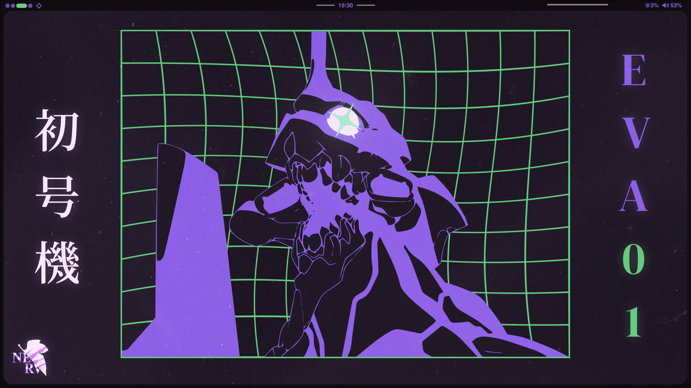

# Chaeri Quickshell
----
## Warning: This is very much still a WIP, do not expect this to work for you out of the box, if at all

## Dependencies
Beyond any dependencies that Quickshell itself has, these are needed to make this config run as intended:

- Pipewire
- Hyprland, this was made for hyprland and will only work on that.

### shell command dependencies
These need to exist in you path, if they don't you may run in to issues, if they're stored elsewhere, you can change the process commands to where.
- [pywal16](https://github.com/eylles/pywal16) or [pywal](https://github.com/dylanaraps/pywal). Use whichever you prefer but keep in mind that pywal is no longer maintained.
 - Other pywal-likes may also work with varying sucess
- [pywal-discord](https://github.com/SnarkyDeveloper/pywal-discord). The original pywal discord has been abandoned but this fork works as a replacement as of 28/11/2025

## IPC calls reference:
---
- wallpaper
  - set: path // temporarily change the wallpaper and theme, resets on reload
- powerMenu
  - toggle // toggles the power menu

## Extras:
You can do some interesting things with ipc calls to make your experience a bit nicer, here are some examples:

For hyprland you can do:
`bind = $mainMod , P, exec, qs ipc call PowerMenu toggle`

If you use [yazi](https://yazi-rs.github.io/) as a file explorer you can add keybinds like this:
`	{ on = "<A-w>", run = 'shell -- qs ipc call wallpaper set "$0"', desc = "Set as wallpaper" },`
to set the wallpaper with a keypress.

Big thanks to [Soramanew](https://github.com/caelestia-dots/shell) for being a huge inspiration and a reference point for a lot of what I've done.
This couldn't have been possible without their work.
